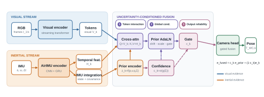

# LingBot-VIO

Pre-acceptance code release for **LingBot-VIO: Uncertainty-Conditioned Inertial Fusion for Streaming Visual Odometry**.

LingBot-VIO augments a streaming visual geometry model with three inertial paths: visual-to-inertial cross-attention, motion-prior AdaLN, and covariance-conditioned confidence gating.



## Release status

This repository currently provides architecture-level source code for method inspection only. Model weights, training and inference entry points, dataset loaders, experiment configurations, evaluation code, environment specifications, raw trajectories, machine-readable results, and complete reproduction instructions are intentionally withheld during peer review. They will be released after the paper is accepted.

The current repository therefore cannot reproduce the paper tables or figures. This is an explicit staged-release policy rather than a claim of full reproducibility.

## Contents

```text
lingbot_vio/models/       Core fusion architecture
third_party/              Vendored AirIMU and LingBot-Map source snapshots
checkpoints/              Pre-acceptance release notice
docs/                     Release policy
```

## Checkpoints and reproducibility

See [checkpoints/README.md](checkpoints/README.md). No checkpoint, download link, checksum, result archive, or trajectory output is included before acceptance.

## Planned post-acceptance release

After acceptance, this repository will add the authorized checkpoints and hashes, training and inference entry points, dataset loaders, experiment configurations, exact environment lockfile, evaluation scripts, result tables, per-sequence trajectories, figure-generation scripts, and end-to-end reproduction commands.

## Third-party code

The vendored source snapshots retain their upstream licenses:

- LingBot-Map: Apache-2.0
- AirIMU: BSD-3-Clause

See `licenses/` and [THIRD_PARTY_NOTICES.md](THIRD_PARTY_NOTICES.md).

## License

The original LingBot-VIO code is released under the Apache License 2.0. Third-party components remain under their respective licenses.
